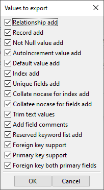
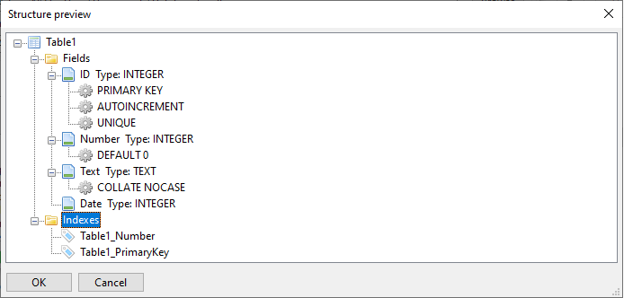

# MDBConverter

## Features
Abillity to transfer:
* Tables
* Fields
* Field Types
  * TEXT
  * REAL
  * INTEGER
  * BLOB
* Records
* Relationships(MS Accces)/Triggers(SQLite)
* Indexes 
* Indexes properties
  * UNIQUE
  * COLLATE NO CASE
* Field comments
* Constraints
  * PRIMARY KEY
  * FOREIGN KEY
  * NOT NULL
  * AUTOINCREMENT
  * DEFAULT
  * UNIQUE
  * COLLATE NO CASE
  
Additional attributes:
 * Multiple primary key support
 * Trim text values - Trim spaces from data from the beggining and end of the record.
 * Reserved key word list - Used to generate warnings if SQLite keywords are used in transferable data thus notifying users of pottencialy uncorrect locations.
 * Foreign key both primary fields - If this element is used FOREIGN KEY is not created if both keys in the relationship are PRIMARY KEYS.
 * SQLite SQL statement dump to a text file.
 
Colourful log:
 * All transfers display
 * Warnings display
 * Errors display
  
## Screenshoots

